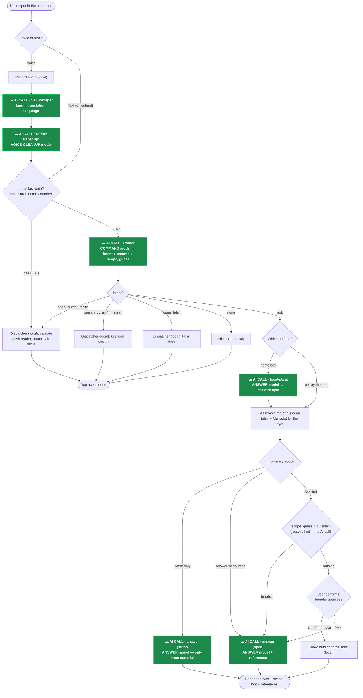

# AI Assistant — implementation plan & decision flow

Status: **planning** (not yet implemented). Scope: the home-page "smart box" that
turns typed/spoken input into either an executed **command**, a **search**, or an
AI **answer** — plus the supporting settings.

---

## 1. New settings (Settings page)

Four new/changed configs, all persisted (`flutter_secure_storage`) and seeded in
`main.dart`:

| Setting | Drives | Default |
|---|---|---|
| **Command model** | `routeCommand` — classify intent (+ scope guess) | `gpt-4o-mini` |
| **Voice-cleanup model** | `refineTranscript` — fix STT typos/words by context | `gpt-4o-mini` |
| **Answer model** | `summarize` / `answer` / `locateAyat` | `gpt-4o-mini` (bump to `gpt-4o`/`gpt-5.1` for depth) |
| **Out-of-tafsir mode** | what to do when a question isn't covered by the tafsir | `Answer with sources` |

The Whisper **STT** model stays `whisper-1` (not one of the text roles).

### Out-of-tafsir mode options
- **Tafsir only (strict)** — answer *only* from the provided authentic tafsir /
  Mufradat. If it's not covered, say so; never use outside knowledge.
- **Answer with sources (default)** — may answer from authentic Shia scholarship
  beyond the tafsir, clearly flagged out-of-scope, with precise references.
- **Ask first** — when the question falls outside the tafsir, show the
  "outside the provided tafsir" notice and a confirm action before producing the
  broader-sourced answer.

The mode is passed into `answer()` and selects the system-prompt variant (and, for
*Ask first*, gates the external-source answer behind a confirmation).

---

## 2. Command allow-list (v1)

Returned by the router as strict JSON `{ intent, params…, scope_guess?, say, confidence }`
and executed only via typed handlers (extends `core/intents.dart`; unknown → dropped).

| Intent | Example | Action |
|---|---|---|
| `open_surah {surah, from_ayah?}` | "open Yāsīn", "go to 2:255" | push reader at ayah |
| `recite {surah, from_ayah?}` | "recite Yāsīn from 5" | push reader + autoplay |
| `search_quran {query}` | "search for patience" | whole-Quran keyword results |
| `search_in_surah {surah, query}` | "find mercy in al-Baqarah" | scoped keyword results |
| `open_tafsir {surah, ayah}` | "tafsir of 2:255" | reader → tafsir sheet |
| `ask {question, scope_guess}` | "why was Solomon tested?" | answer pipeline |
| `none {reason}` | unclear | hint toast |

`scope_guess ∈ {in_tafsir, outside, unknown}` is only a **fast hint** from the
router (it hasn't seen the tafsir text). The **authoritative** `in_scope` comes
from the `answer()` call, which does see the gathered material.

---

## 3. AI interaction & decision flow

Every node tagged **`☁ AI CALL`** (and drawn in green) is a network round-trip to
OpenAI. Plain (grey) nodes are local/in-app work — **zero** AI calls. Count the
green nodes along your route to know how many calls happened (the table in §3.1
lists the totals for the common routes).

### 3.1 AI calls per route

Counting the green `☁ AI CALL` nodes:

| Route | AI calls | Breakdown |
|---|---|---|
| Typed, bare surah name/number (fast-path) | **0** | — |
| Typed command / search / open_tafsir | **1** | router |
| Voice command / search / open_tafsir | **3** | STT + refine + router |
| Typed question — home box | **3** | router + locateAyat + answer |
| Voice question — home box | **5** | STT + refine + router + locateAyat + answer |
| Typed question — per-ayah sheet (no router/locate) | **1** | answer |
| Voice question — per-ayah sheet | **3** | STT + refine + answer |
| Ask-first, user declines external answer | **−1** vs above | the final `answer` call is skipped |

Notes:
- The **per-ayah AI sheet** is a separate entry point: it enters the diagram at the
  `ask → per-ayah sheet` branch, so it has **no router and no locateAyat** call —
  its material is already loaded from the open ayat.
- `scope_guess` is produced *inside* the router call, so the **Ask-first** decision
  costs **no extra** AI call; it only changes whether the final `answer` call runs.
- The local **fast-path** is the only way a command reaches **0** AI calls.

---

## 4. Code touch-points

- `OpenAiClient`
  - `routeCommand(text, lang, {model})` + `_commandSystem()` — emits the JSON above.
  - `answer(...)` gains an `outOfScopeMode` arg → selects the prompt variant.
  - `refineTranscript` / `summarize` / `locateAyat` unchanged except model source.
- `core/intents.dart` — add the v1 command intents (typed, validated `fromJson`).
- `features/assistant/command_dispatcher.dart` (new) — validate (surah 1–114, ayah
  in range via `LocalContent`; fuzzy surah-name + reciter backstops) and execute
  (Navigator + providers). Needs a global navigator key.
- `features/settings/ai_settings_controller.dart` — 3 model keys + out-of-scope mode
  key; 3 providers + 1 mode provider; migrate old `ai_model` → answer model.
- `settings_page.dart` — 3 model pickers + out-of-scope mode selector.
- `surah_reader_page.dart` — `autoplayFrom` param.
- Home search box → single auto-detect smart bar (replaces the Surahs/Keywords
  toggle; live local surah-name filter as you type; routes on submit/voice; reuses
  `AiInputBar` for the mic).

---

## 5. Safety / cost notes

- Only allow-listed intents run; all params validated; no arbitrary string is ever
  executed (project hard-rule #2).
- Navigation/playback are reversible; misclassification is contained by validation
  + the AI's `say` confirmation toast + the `none` fallback.
- One **command-model** call per submit (cheap). The local fast-path skips it for
  bare surah names. The **answer-model** call (and, for the home flow, a
  `locateAyat` call) happen only for `ask`.
